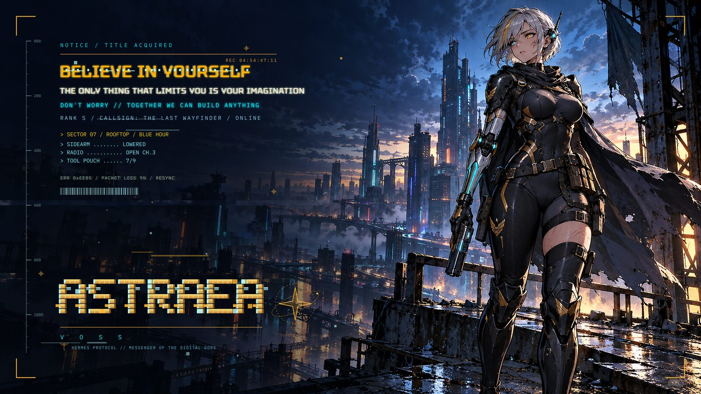
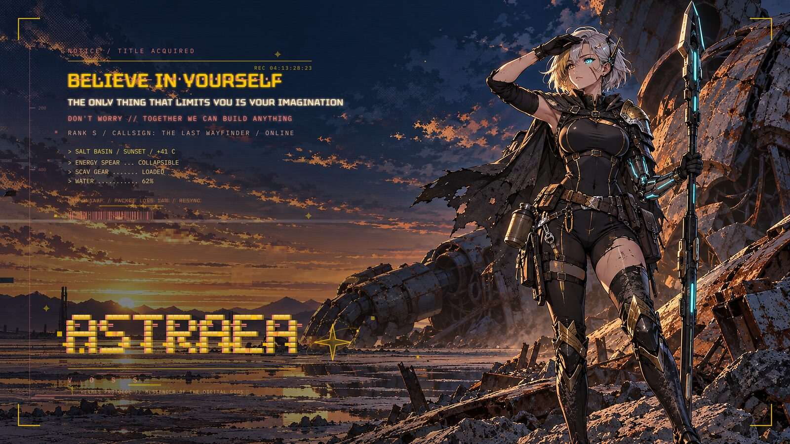
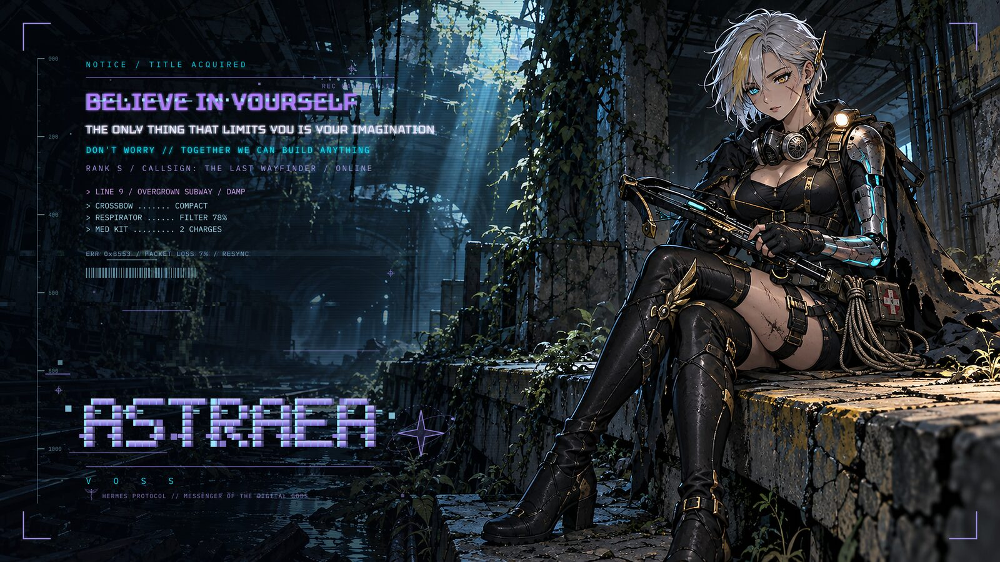
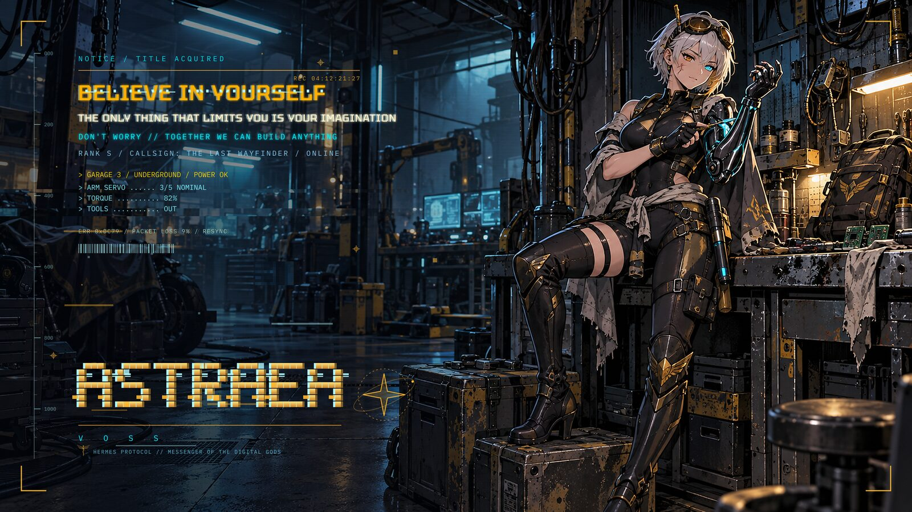
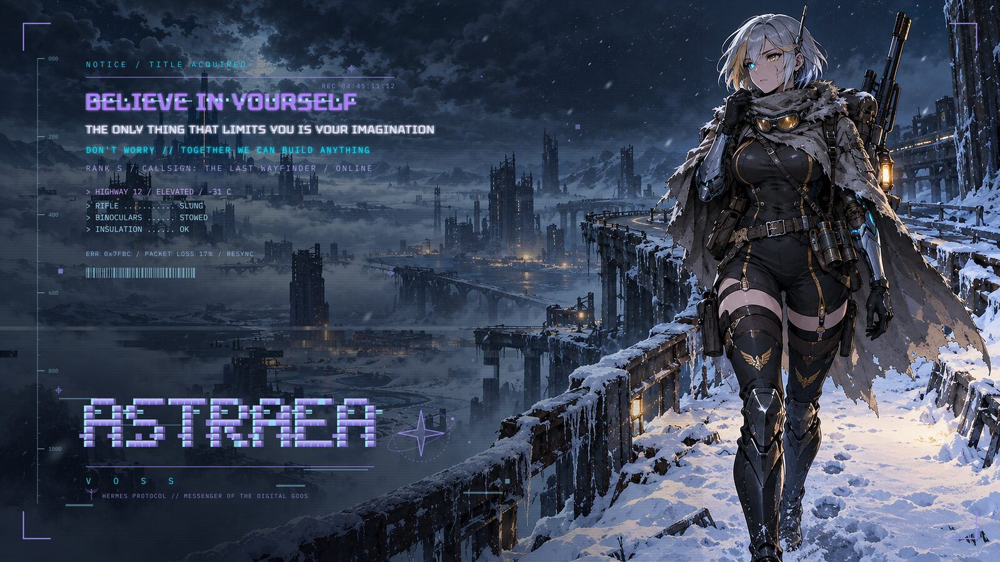
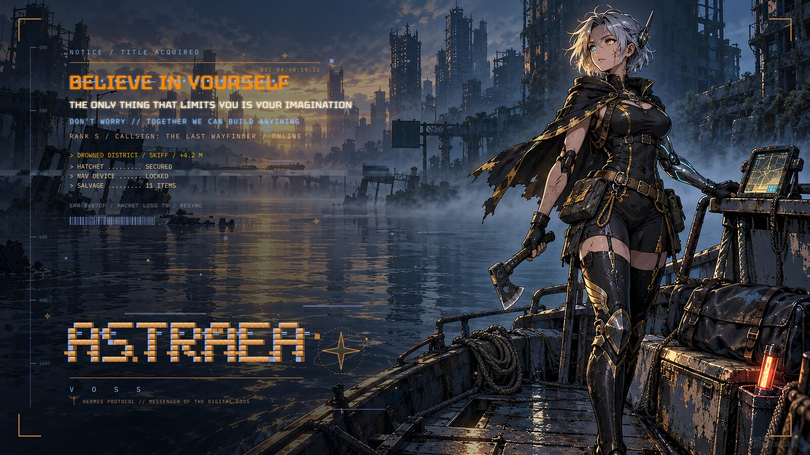
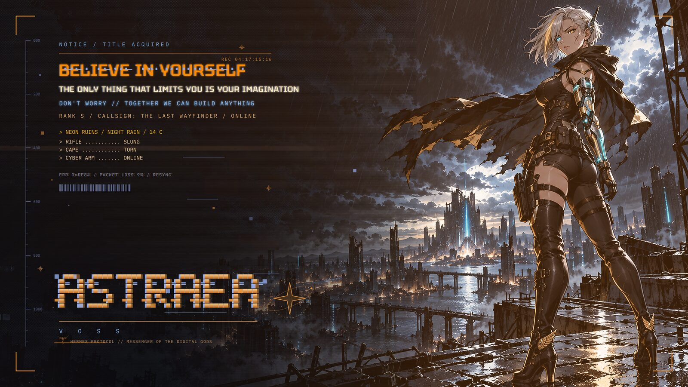

# Astraea — HUD wallpapers & themes for Omarchy

A small toolchain that turns your own scene art into **HUD wallpapers** (System-window / Ghost-in-the-Shell style),
bundles them into four **[Omarchy](https://omarchy.org) themes**, and can optionally draw the HUD as a **live animated overlay**
(typewriter text, ticking timecode, glitch bursts) instead of baking it into the pictures.

Character: **Astraea Voss — "The Last Wayfinder"**. A small caduceus + *"Hermes protocol // messenger of the digital gods"*
is a nod to Hermes, the guide of travelers.



| | | |
|---|---|---|
|  |  |  |
|  |  |  |

*Previews are the finished static wallpapers. The art itself is AI-generated and is **not** included in this repo (see [art/README.md](art/README.md)) —
bring your own, the HUD builder works with any 16:9 image.*

## What you get
- **Per-scene HUD**: headline, subline, motto line, rank/callsign, scene readout (location + 3 kit lines), pixel-font wordmark,
  edge ruler, corner brackets, scanlines.
- **Digital artefacts**: feathered tear bands, pixelated macroblocks, RGB-split wordmark with dropped/stray cells, title slice, dead pixels, grain.
  Builds are **reproducible** (seeded).
- **Colour-by-role typography** per theme (neon headline, white subline, themed motto line…) — all in one JSON file.
- **Four themes** (`Astraea Section 9 / Gold / Shadow / Post Apo`), two wallpapers each, created from templates in `themes/`.
- **Two HUD modes you can switch between at any time**:

  | | `static` | `animated` |
  |---|---|---|
  | Text | baked into the wallpaper | drawn live by a click-through Quickshell layer |
  | Cost | zero | ≈1.5 % of one core, ≈200 MB RAM |

  ```
  astraea-hud static | animated | toggle | status
  ```

## Requirements
Linux with [Omarchy](https://omarchy.org) (Hyprland + Quickshell) · Python 3 · ImageMagick (`magick`) · librsvg (`rsvg-convert`).
Only the installer and the animated overlay need Omarchy; `src/build_hud.py` just needs Python, ImageMagick and librsvg.
Fonts (Tektur, Geist Mono — SIL OFL) are bundled.

## Quick start
```bash
git clone https://github.com/<you>/omarchy-astraea.git ~/astraea-voss && cd ~/astraea-voss

# 1. your art: 2560x1440 images -> art/upscaled/scene-1.png … scene-6.png   (see art/README.md)
magick my-image.png -filter Lanczos -resize 2560x1440! art/upscaled/scene-1.png

# 2. build the HUD wallpapers (about 40 s)             -> dist/<theme>/scene-N-tag.png  + contact sheet
python3 src/build_hud.py

# 3. look at dist/contact-sheet.png, then install into Omarchy (creates the themes from themes/ if missing)
python3 src/install_to_themes.py --dry-run
python3 src/install_to_themes.py --apply          # installs, then switches to "Astraea Section 9"

# 4. optional: animated mode + a short command
ln -sf "$PWD/src/hud-mode.sh" ~/.local/bin/astraea-hud
astraea-hud animated
```
Cycle wallpapers with `omarchy theme bg next`. For the overlay to start at login, add
`o.launch_on_start("/path/to/astraea-voss/src/overlay.sh start")` to `~/.config/hypr/autostart.lua`
(it only starts when the saved mode is `animated`).

## Make it yours
Everything lives in **`config/project.json`**: the name/callsign/rank, every line of text (motto, tribute…), per-theme colours and typography
colours, glitch amounts, and each scene (`theme`, `tag`, `location`, `kit`, `clear_width`, `shade`, optional `image`).
Change a word → `python3 src/build_hud.py` → `python3 src/install_to_themes.py`. Rename a theme with `folder` / `name`
(+ `renamed_from` to migrate an existing one). Full pipeline, gotchas and rollback notes: **[WORKFLOW.md](WORKFLOW.md)**.

## Layout
```
config/    project.json (all wording, scenes, colours) · bible.txt (character prompt for image generation)
src/       build_hud.py · install_to_themes.py · hud-mode.sh · overlay.sh
overlay/   Quickshell QML for the animated mode (shell.qml, Hud.qml, TypeLine.qml)
themes/    text-file templates for the four Omarchy themes
assets/    bundled fonts (OFL)
docs/      design philosophy + previews
```

## Notes
- Fan-inspired styling (Solo Leveling's System window, Ghost in the Shell, Hermes imagery). Not affiliated with or endorsed by any of them.
- Your wallpapers are replaced in the *Astraea* theme folders only; anything it removes is archived, never deleted, and theme text files are backed up before each install.
- The animated overlay is a normal Quickshell config — stop it any time with `astraea-hud static` or `src/overlay.sh stop`.

## License
Code: MIT (see `LICENSE`). Bundled fonts: SIL OFL 1.1.
